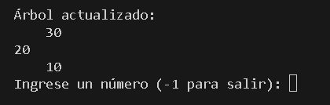

# Proyecto: : Implementación de Árbol AVL en Java

## Descripción del problema

Este proyecto permite insertar números enteros en un árbol AVL.  
Se trata de una estructura de datos que se mantiene equilibrada tras cada inserción, garantizando eficiencia al buscar, insertar o eliminar valores.

Cada vez que se ingresa un número, el árbol se actualiza y se muestra su estructura en consola.  
Se puede ingresar la cantidad de números deseada y salir cuando se indique.

---

## Entradas

El usuario puede ingresar una lista de números de forma manual por consola.  
**Ejemplo:**
c:\Users\Dell\AppData\Local\Packages\MicrosoftWindows.Client.Core_cw5n1h2txyewy\TempState\ScreenClip\{15370001-C347-49E2-B7EC-DF2875998B25}.png

---

## Salida

Tras cada inserción, el programa muestra en consola el árbol AVL actualizado con su respectiva jerarquía de nodos.

**Ejemplo de salida en consola:**

Cada nivel del árbol se representa con sangrías de 4 espacios para indicar profundidad.

---

## Ejemplo gráfico del árbol AVL generado

Supongamos que se insertan los números en este orden:

`10, 20, 30`

El árbol se vería así:

---

## Instrucciones para ejecutar el proyecto
nos vmoas a nuestra consola en el area de main presionamos Ctrl + ñ, luego de este escribimos
javac Main.java AVLTree.java Enter
java Main
luego de esto ya podemos escribir los numeros que deseamos agregar vamos presionando enter, automaticamente el arbol se ira completando.

---

## Video de youtube 
https://youtu.be/joWWWSPFUOM
